# Jotform Workflow MCP Architecture

This is the architecture I built around the Jotform Workflow MCP server. The
main goal is to let ChatGPT safely operate Jotform Workflows without guessing
API shapes, creating broken workflow nodes, or losing the previous state after
each change.

At a high level, the server translates user intent into schema-checked MCP
tool calls, normalizes them into the same JSON shapes the Jotform Workflow
builder expects, writes through the public Jotform API, then verifies the
result with read-back, audit logs, and revision snapshots.

## 1. Runtime Topology

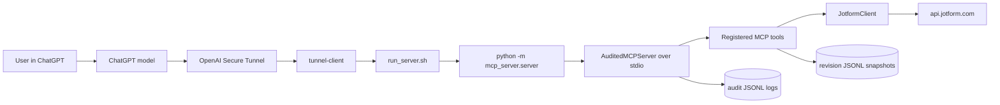

The active tunnel chain is:

```text
ChatGPT
-> OpenAI Secure Tunnel
-> tunnel-client
-> run_server.sh
-> ./.venv/bin/python -m mcp_server.server
-> stdio MCP server
```

`api.py` is intentionally not part of the current runtime path. The plugin
profile points to `run_server.sh`, and that script starts `mcp_server.server`
as a stdio MCP server. This keeps the tunnel setup simpler because there is no
extra HTTP/SSE layer, no local port, and no CORS surface.

## 2. Server Boot

`mcp_server/server.py` is deliberately small. It loads environment variables,
creates the audited MCP server, initializes the Jotform client, and registers
the tool layers.

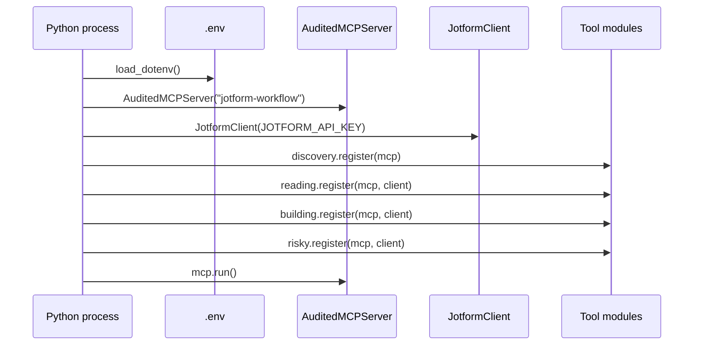

The server exposes 20 MCP tools:

```text
list_step_types
get_step_schema
list_workflows
get_workflow
get_step_details
list_workflow_revisions
inspect_workflow_gaps
list_forms
get_form_fields
create_form_with_ai
create_workflow
create_workflow_with_ai_form
add_step
connect_steps
disconnect_steps
update_step
delete_step
publish_workflow
restore_workflow_revision
delete_workflow
```

## 3. Transport Boundaries

### ChatGPT to MCP

ChatGPT never calls Jotform directly. It calls MCP tools with JSON arguments.
The server owns validation, normalization, Jotform API calls, logging, and
read-back verification.

```json
{
  "name": "add_step",
  "arguments": {
    "workflow_id": "262251776639972",
    "step_type": "workflow_send_email",
    "config": {
      "name": "Application received",
      "to": ["{q3_email1}"],
      "subject": "We received your application",
      "content": "Hi {q2_fullname0}, thanks for applying."
    },
    "after_step_id": "1",
    "intent": "Send application receipt to applicant",
    "reason": "User asked for a confirmation email after submission"
  }
}
```

### MCP to ChatGPT

Every tool returns structured JSON with an `error` field. I return errors as
data instead of raising whenever possible, because ChatGPT can then explain the
problem and ask the user for the missing detail instead of silently failing.

```json
{
  "step_id": "2",
  "type": "workflow_send_email",
  "linked_from": "1",
  "warnings": [
    "wrapped plain text email content as HTML",
    "normalized email content field tokens from trigger form 262251294728057"
  ],
  "error": null,
  "hint": null
}
```

### MCP to Jotform

The server uses the public Jotform API:

```text
https://api.jotform.com
```

The API key is sent as a query param:

```json
{
  "apiKey": "[REDACTED]"
}
```

Audit logs redact secret values before writing them.

## 4. Audit Log Flow

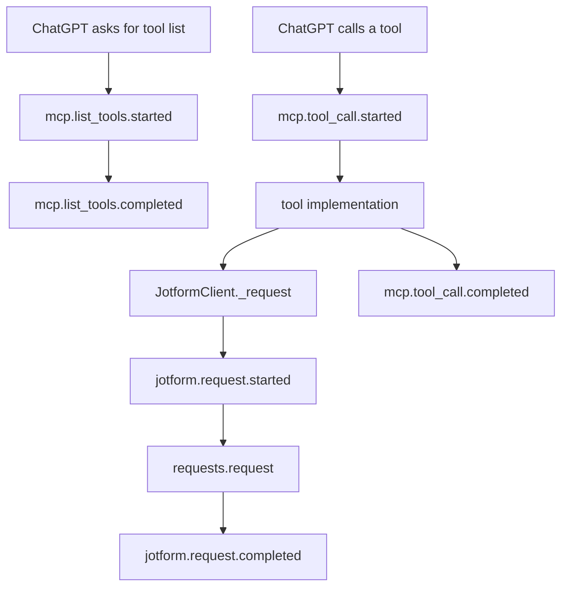

Logs are JSONL, one JSON object per line. This keeps the runtime dependency
free, easy to inspect with `jq`/`rg`, and easy to ship to a log collector later.

```text
mcp_server/logs/sessions/{started_at}_{session_id}.jsonl
```

Default event shapes:

```json
{
  "timestamp": "2026-08-14T07:32:13.446217+00:00",
  "session_id": "eb6c89bb7c74425e84a75b1702281b33",
  "event_type": "mcp.tool_call.completed",
  "request_id": "e165eb85-25b9-4631-afc9-7779fbafac2b",
  "tool": "inspect_workflow_gaps",
  "duration_ms": 5177.4,
  "result": {
    "structured_content": {
      "ok_to_publish": true,
      "issues": [],
      "error": null
    },
    "is_error": false
  },
  "is_error": false
}
```

```json
{
  "timestamp": "2026-08-14T07:32:12.194183+00:00",
  "session_id": "eb6c89bb7c74425e84a75b1702281b33",
  "event_type": "jotform.request.completed",
  "request_id": "a5779ae8-244d-4a30-9929-154e8af12644",
  "method": "GET",
  "url": "https://api.jotform.com/workflow/262251776639972/elements/8",
  "status_code": 200,
  "duration_ms": 412.8,
  "response_text": "{\"responseCode\":200,\"message\":\"success\",...}"
}
```

Important environment variables:

```text
MCP_AUDIT_SESSION_ID      optional fixed session id
MCP_AUDIT_LOG_DIR         default mcp_server/logs
MCP_AUDIT_LOG_PATH        explicit single log file override
MCP_AUDIT_MAX_FIELD_CHARS default 12000
```

## 5. Revision Flow

Every mutating operation saves a workflow snapshot before writing. This is the
undo/revision layer: if ChatGPT or the user wants to go back, the server can
restore the previous workflow state with one tool call.

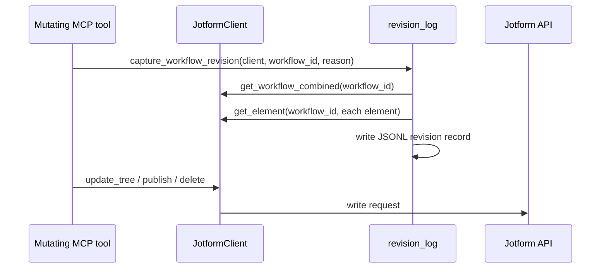

Revision files live under:

```text
mcp_server/revisions/{workflow_id}.jsonl
```

Each revision stores:

```json
{
  "revision_id": "178d9d20d4424494834ef2f96a760348",
  "timestamp": "2026-08-14T07:12:24.081818+00:00",
  "session_id": "169a1517a24642d19482873a6a404165",
  "workflow_id": "262251776639972",
  "workflow_url": "https://www.jotform.com/workflow/262251776639972/build",
  "reason": "before connect_steps 3->6 (...)",
  "snapshot": {
    "workflow": {},
    "elements": [],
    "links": []
  }
}
```

Restore is two-phase so it cannot accidentally overwrite the workflow:

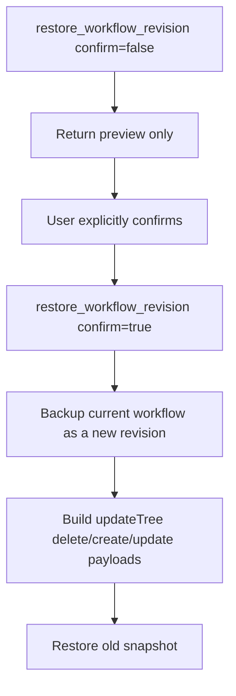

## 6. Jotform API Endpoints Used

```text
GET    /user/forms
GET    /form/{form_id}/questions
POST   /workflow/copilot/createWorkflowForm
GET    /user/workflows
GET    /workflow/{workflow_id}/combined
GET    /workflow/{workflow_id}
GET    /workflow/{workflow_id}/elements
GET    /workflow/{workflow_id}/elements/{element_id}
GET    /workflow/{workflow_id}/links
POST   /workflow
POST   /workflow/{workflow_id}
PUT    /workflow/{workflow_id}/updateTree
POST   /workflow/{workflow_id}/setResource
POST   /workflow/{workflow_id}/publish
DELETE /workflow/{workflow_id}
```

The key write endpoint is:

```text
PUT /workflow/{workflow_id}/updateTree
```

Payload:

```json
{
  "elements": [
    {
      "action": "create | update | delete",
      "elementID": 2,
      "data": {}
    }
  ],
  "links": [
    {
      "action": "create | update | delete",
      "linkID": 1,
      "data": {}
    }
  ]
}
```

## 7. Element JSON Shape

Create element:

```json
{
  "action": "create",
  "elementID": 2,
  "data": {
    "element_id": 2,
    "id": 2,
    "type": "workflow_send_email",
    "elementType": "workflow_send_email",
    "name": "Application received",
    "subject": "We received your application",
    "to": [
      {
        "id": "uuid",
        "value": "{q3_email1}",
        "text": "Email Address",
        "isValid": true,
        "isQuestion": true,
        "style": {
          "backgroundColor": "#007862",
          "--pillColor": "#007862"
        },
        "isBright": false,
        "formTitle": "Candidate Application Form"
      }
    ],
    "content": "<!DOCTYPE html><html><body><p>Hi {q2_fullname0}</p></body></html>",
    "x": 0,
    "y": 180,
    "position": {"x": 0, "y": 180},
    "measured": {"width": 296, "height": 88}
  }
}
```

Update element:

```json
{
  "action": "update",
  "elementID": 3,
  "data": {
    "element_id": 3,
    "outcomes": [
      {
        "id": 1,
        "outcomeID": 1,
        "type": "CUSTOM",
        "text": "Proceed to Interview",
        "linkID": 4
      }
    ]
  }
}
```

Delete element:

```json
{
  "action": "delete",
  "elementID": 3,
  "data": {"element_id": 3}
}
```

## 8. Link JSON Shape

Links use a constant builder-compatible shape:

```json
{
  "action": "create",
  "linkID": 7,
  "data": {
    "link_id": 7,
    "fromElement": "3",
    "toElement": "4",
    "type": "default-link",
    "points": [{"a": "1"}],
    "fromPortName": "DYNAMIC_BOTTOM_1_Out",
    "toPortName": "DYNAMIC_TOP_1_In"
  }
}
```

For branching steps, the link alone is not enough. The source element's
`outcomes[].linkID` must also be updated. This was one of the most important
parts of the implementation because it makes task/approval/condition outcomes
selectable and valid in the builder UI.

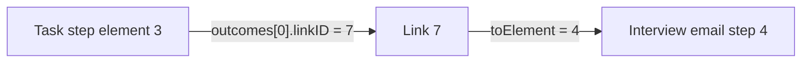

Branch link label update:

```json
{
  "action": "update",
  "linkID": 7,
  "data": {
    "link_id": 7,
    "labels": [
      {
        "justCreated": true,
        "label": "Proceed to Interview"
      }
    ]
  }
}
```

This is why connecting a task/approval/condition branch is a two-write logic:

```text
create link
then label link + set source.outcomes[n].linkID
```

## 9. Trigger Form Binding

Workflow creation with a trigger form is intentionally two-step. Jotform needs
both a resource binding and a start-node update, so the MCP server does both
and then reads element `1` back to verify the trigger form is really attached.

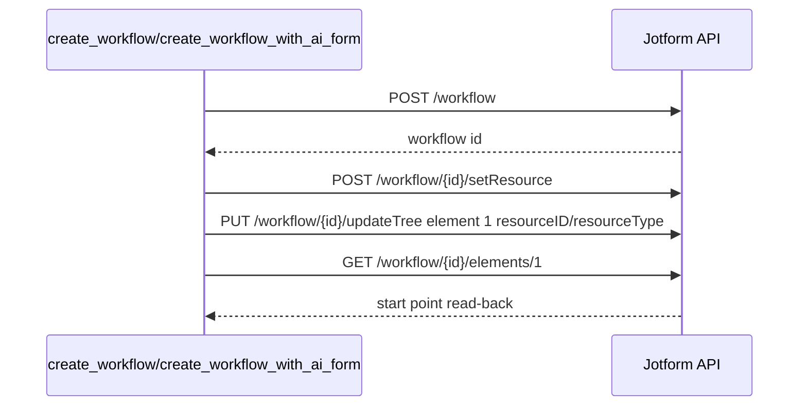

`setResource` payload:

```json
{
  "resourceType": "FORM",
  "resourceID": "262251294728057"
}
```

`updateTree` start-point payload:

```json
{
  "links": [],
  "elements": [
    {
      "elementID": 1,
      "action": "update",
      "data": {
        "resourceID": "262251294728057",
        "resourceType": "FORM",
        "element_id": 1,
        "subType": "workflow_start_point_submission"
      }
    }
  ]
}
```

## 10. Tool Arguments and Schemas

These MCP tool schemas are the contract between ChatGPT and the server. ChatGPT
chooses a tool and sends these arguments as JSON. The server returns one of the
Pydantic result schemas listed in the next section.

| Tool | Arguments |
| --- | --- |
| `list_step_types` | `category=""` |
| `get_step_schema` | `step_type` |
| `list_workflows` | none |
| `get_workflow` | `workflow_id` |
| `get_step_details` | `workflow_id`, `step_id` |
| `list_workflow_revisions` | `workflow_id`, `limit=10` |
| `inspect_workflow_gaps` | `workflow_id` |
| `list_forms` | none |
| `get_form_fields` | `form_id` |
| `create_form_with_ai` | `prompt`, `form_type="classic"`, `language="en"`, `intent=""`, `reason=""` |
| `create_workflow` | `title`, `trigger_form_id=""`, `allow_without_trigger=false`, `intent=""`, `reason=""` |
| `create_workflow_with_ai_form` | `title`, `form_prompt`, `form_type="classic"`, `language="en"`, `intent=""`, `reason=""` |
| `add_step` | `workflow_id`, `step_type`, `config`, `after_step_id=""`, `allow_duplicate=false`, `intent=""`, `reason=""` |
| `connect_steps` | `workflow_id`, `from_step_id`, `to_step_id`, `outcome=""`, `intent=""`, `reason=""` |
| `disconnect_steps` | `workflow_id`, `link_id`, `intent=""`, `reason=""` |
| `update_step` | `workflow_id`, `step_id`, `config`, `intent=""`, `reason=""` |
| `delete_step` | `workflow_id`, `step_id`, `confirm=false`, `intent=""`, `reason=""` |
| `publish_workflow` | `workflow_id`, `confirm=false`, `intent=""`, `reason=""` |
| `restore_workflow_revision` | `workflow_id`, `revision_id=""`, `confirm=false`, `intent=""`, `reason=""` |
| `delete_workflow` | `workflow_id`, `confirm=false`, `confirm_title=""`, `intent=""`, `reason=""` |

### MCP Result Schemas

The response direction is just as important as the request direction. ChatGPT
does not receive loose text from the tools; it receives structured result
objects. Every result includes either useful data, `error`, or both.

| Tool | MCP -> ChatGPT result schema |
| --- | --- |
| `list_step_types` | `StepTypeList { step_types[] }` |
| `get_step_schema` | `StepSchema { step_type, canonical_type, subtype, description, ui_name, fields[], error, hint, available_types[] }` |
| `list_workflows` | `WorkflowList { workflows[], error }` |
| `get_workflow` | `WorkflowDetail { workflow_id, workflow_url, title, status, publish_status, steps[], connections[], health, diagnostics, error }` |
| `get_step_details` | `StepDetail { step_id, type, sign_url, config, error }` |
| `list_workflow_revisions` | `WorkflowRevisionList { workflow_id, workflow_url, revisions[], error }` |
| `inspect_workflow_gaps` | `WorkflowGapReport { workflow_id, workflow_url, trigger_form_id, trigger_form_url, ok_to_publish, issues[], available_form_fields[], error }` |
| `list_forms` | `FormList { forms[], error }` |
| `get_form_fields` | `FormFieldList { form_id, form_url, fields[], error }` |
| `create_form_with_ai` | `CreateAIFormResult { form_id, form_url, title, summary, questions, error }` |
| `create_workflow` | `CreateWorkflowResult { workflow_id, workflow_url, title, trigger_form_id, trigger_form_url, error }` |
| `create_workflow_with_ai_form` | `CreateWorkflowWithAIFormResult { workflow_id, workflow_url, title, trigger_form_id, trigger_form_url, form_title, form_summary, questions, error }` |
| `add_step` | `AddStepResult { step_id, type, existing_step_id, linked_from, warnings[], error, hint }` |
| `connect_steps` | `ConnectStepsResult { link_id, from_step, to_step, outcome, error, hint }` |
| `disconnect_steps` | `DisconnectStepsResult { link_id, from_step, outcome_cleared, disconnected, error }` |
| `update_step` | `UpdateStepResult { step_id, warnings[], error, hint }` |
| `delete_step` | `DeleteStepResult { step_id, type, label, needs_confirmation, affected_connections[], deleted, verified, error, hint }` |
| `publish_workflow` | `PublishWorkflowResult { workflow_id, needs_confirmation, health_warnings[], published, error, hint }` |
| `restore_workflow_revision` | `RestoreWorkflowRevisionResult { workflow_id, workflow_url, revision_id, revision_timestamp, session_id, reason, target_title, target_step_count, target_link_count, current_backup_revision_id, needs_confirmation, restored, error, hint }` |
| `delete_workflow` | `DeleteWorkflowResult { workflow_id, title, needs_confirmation, deleted, error, hint }` |

### Schema Discovery Flow

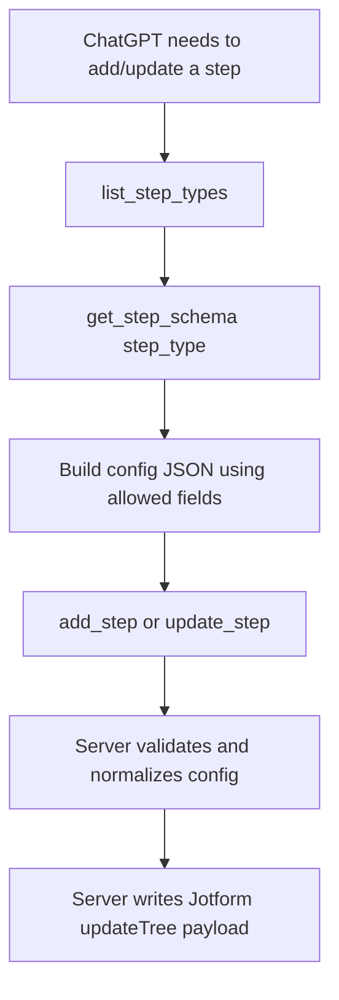

The important schema rule is: ChatGPT should ask `get_step_schema` before it
creates or updates a step. The schema gives field names, simple types, fixed
values, allowed enum values, canonical API type, and UI subtype mapping.

## 11. Main User Journeys

### New Workflow with New AI Form

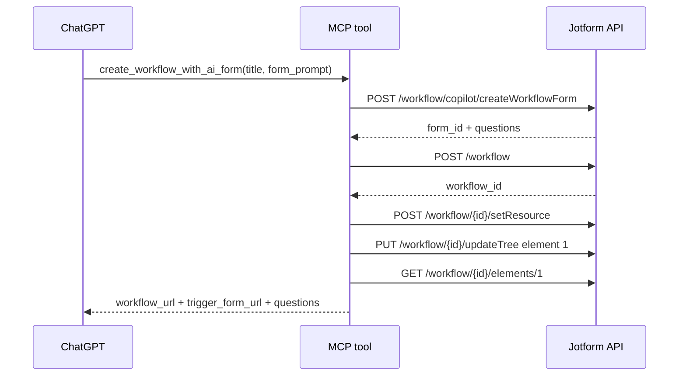

### Add Email Step

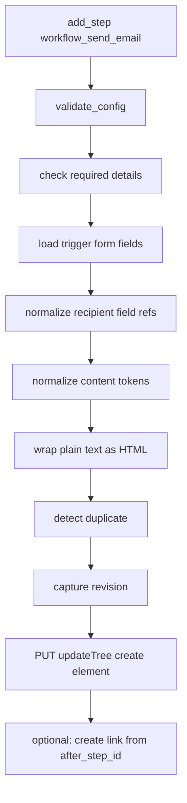

### Connect Branch Outcome

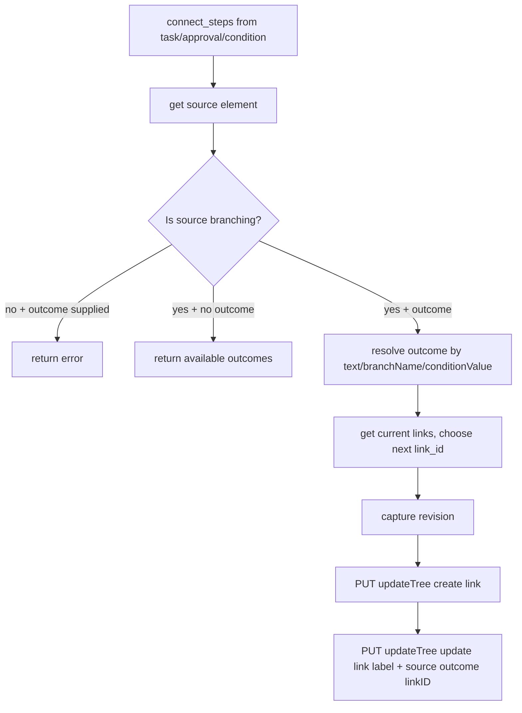

### Delete Step

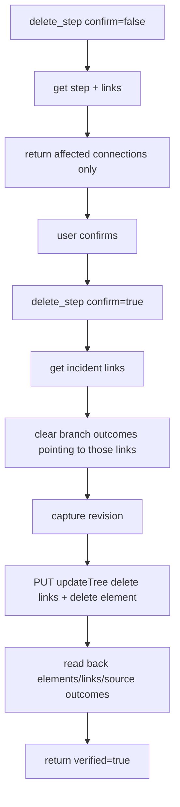

## 12. Data Normalization Rules

### Email recipients and assignees

A submission email field is represented as a builder pill object:

```json
{
  "id": "uuid",
  "value": "{q3_email1}",
  "text": "Email Address",
  "isValid": true,
  "isQuestion": true,
  "style": {
    "backgroundColor": "#007862",
    "--pillColor": "#007862"
  },
  "isBright": false,
  "formTitle": "Candidate Application Form"
}
```

A fixed email is represented as:

```json
{
  "id": "uuid",
  "value": "hr@example.com",
  "text": "hr@example.com",
  "isValid": true,
  "isQuestion": false
}
```

The server rejects invalid plain assignee text. For dynamic recipients, it
requires real trigger form fields, not guessed labels.

### Field tokens in content

Input like this:

```text
Hi {2}, thanks for applying to {5}.
```

is normalized to the real question names:

```text
Hi {q2_fullname0}, thanks for applying to {q5_textbox3}.
```

### Selected flattened properties

Before `updateTree`, selected nested element config is flattened to match
the builder wire shape:

```json
{
  "pause": {
    "activated": "Yes",
    "executeWhen": {
      "afterAmount": "2",
      "afterUnit": "day"
    }
  }
}
```

becomes:

```json
{
  "pause__activated": "Yes",
  "pause__executeWhen__afterAmount": "2",
  "pause__executeWhen__afterUnit": "day"
}
```

This is targeted. Email `to`, `attachment`, and similar nested shapes are not
flattened because the builder expects them as objects/arrays.

## 13. Health and Gap Checks

`get_workflow` reports graph health:

```json
{
  "health": {
    "total_steps": 7,
    "unreachable_steps": [],
    "dead_end_steps": [],
    "unknown_types": [],
    "dangling_links": [],
    "unconnected_branches": [],
    "invalid_branch_links": [],
    "unlabelled_branching_steps": []
  }
}
```

`inspect_workflow_gaps` is stricter and more UX-oriented. It checks:

```text
missing assignees/approvers
missing email recipients/subject/content
empty task descriptions
unconnected outcomes
dangling links
invalid condition field ids
unlabelled branch links
```

It returns suggested questions so ChatGPT asks the user instead of creating
broken placeholder steps.

## 14. Schema and UI Variant Mapping

Some UI names are not separate API element types. They are canonical `type`
plus `subType`.

| UI / MCP step_type | API `type` | API `subType` |
| --- | --- | --- |
| `workflow_approval_with_sign` | `workflow_approval` | `workflow_approval_with_sign` |
| `workflow_team_approval` | `workflow_approval` | `workflow_team_approval` |
| `workflow_send_pdf` | `workflow_send_email` | `workflow_send_pdf` |
| `workflow_send_approval_report` | `workflow_send_email` | `workflow_send_approval_report` |
| `workflow_payment_form` | `workflow_assign_form` | `workflow_payment_form` |
| `workflow_pause_duration` | `workflow_pause` | `workflow_pause_duration` |
| `workflow_pause_wait` | `workflow_pause` | `workflow_pause_wait` |

Verified special cases:

```text
workflow_payment_verification
  formID
  verificationMethod = manual | data
  approver for manual verification
  outcomes = Verify / Not Verify

workflow_pause_duration
  pause.executeWhen.afterAmount
  pause.executeWhen.afterUnit

workflow_pause_wait
  pause/wait date-style config, exposed through schema-safe fields
```

## 15. Safety Rules to Remember

```text
Do not create a workflow without a trigger form unless allow_without_trigger=true.
Do not add empty task/approval/email/condition/sign steps.
Do not use labels as condition field ids; use get_form_fields field_id.
Do not connect branching steps without outcome.
Do not duplicate similar steps unless allow_duplicate=true.
Do not delete/publish/restore on first call; preview first, confirm second.
Do not trust link labels alone; branching truth is source.outcomes[].linkID.
Do not call internal www.jotform.com/API BFF from the MCP server.
```

## 16. Mental Model

The MCP server is a translator with guardrails:

```text
Natural language intent
-> MCP tool arguments
-> schema validation
-> normalization into builder-compatible JSON
-> revision snapshot
-> public Jotform API request
-> read-back / health check
-> structured result for ChatGPT
-> audit log JSONL for debugging
```

The most important concept: workflow structure is split across two arrays.

```json
{
  "elements": [
    {
      "element_id": "3",
      "type": "workflow_assign_task",
      "outcomes": [
        {"outcomeID": 1, "text": "Proceed", "linkID": 7}
      ]
    }
  ],
  "links": [
    {
      "link_id": "7",
      "fromElement": "3",
      "toElement": "4"
    }
  ]
}
```

If either side is missing, the UI may draw something wrong or ChatGPT may not
be able to select the outcome later.
